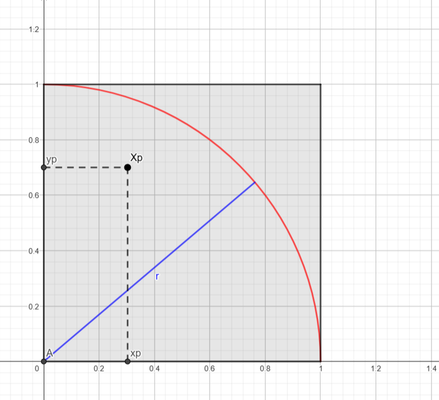
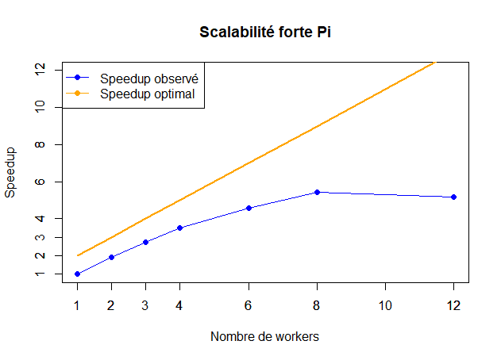
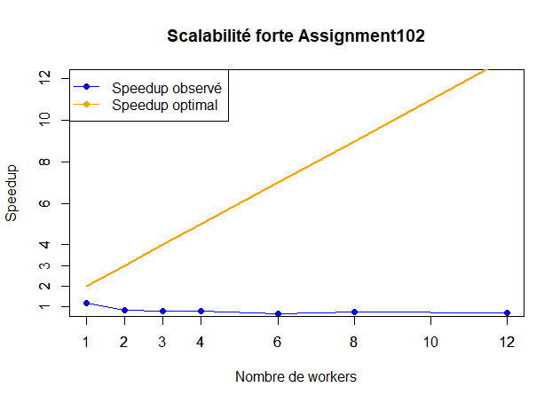
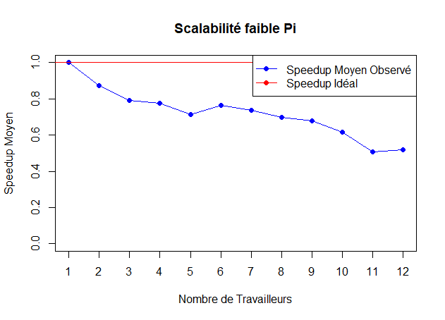
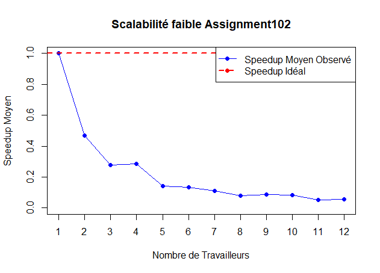

# **Rapport**

## Sommaire
1. [Méthode de Monte-Carlo](#i---methode-de-monte-carlo)  
   1.1. [Présentation de la méthode de Monte Carlo](#presentation-de-la-methode-de-monte-carlo)  
   1.2. [Exemple : Calcul de π](#exemple-calcul-de-π)  
   1.3. [Génération de points aléatoires](#generation-de-points-aleatoires)  
   1.4. [Estimation de π](#estimation-de-π)
2. [Algorithme de parallélisation](#ii---algorithme-de-parallelisation)  
   2.1. [Représentation de l'algorithme](#representation-de-lalgorithme)  
   2.2. [Analyse de la parallélisation](#analyse-de-la-parallelisation)  
   2.3. [Paradigmes de parallélisation](#paradigmes-de-parallelisation)
3. [Mise en œuvre](#iii---mise-en-œuvre)  
   3.1. [Analyse de Assignement102](#analyse-de-assignement102)  
   3.2. [Analyse de Pi](#analyse-de-pi)
4. [Tests de performance](#iv---tests-de-performance)  
   4.1. [Scalabilité forte](#scalabilite-forte)  
   4.2. [Scalabilité faible](#scalabilite-faible)


## I - Méthode de Monte-Carlo

### 1.1. Présentation de la méthode de Monte Carlo
La méthode de Monte Carlo est une technique numérique qui résout des problèmes complexes via des simulations aléatoires, en particulier lorsqu'aucune méthode analytique n'est disponible. Elle génère des valeurs aléatoires pour explorer un espace de possibilités et estimer un résultat statistiquement.

### 1.2. Exemple : Calcul de π
La méthode de Monte Carlo peut être utilisée pour estimer la valeur de $\pi$ en considérant un cercle de rayon 1 inscrit dans un carré de côté 1. En générant des points aléatoires à l'intérieur du carré et en comptant ceux qui tombent à l'intérieur du cercle, on peut estimer $\pi$.

#### Image du modèle :


### 1.3. Génération de points aléatoires
Les points $P(x_p, y_p)$ sont générés de manière uniforme dans le carré, avec $x_p$ et $y_p$ issus d'une distribution uniforme $U(]0,1[)$. La probabilité qu’un point se trouve dans le cercle est donnée par :

$$
P = \frac{\pi}{4}
$$

En tirant un grand nombre de points $N_\text{tot}$ et en comptant $N_\text{cible}$ ceux dans le cercle, on peut estimer $\pi$ via la formule :

$$
\pi \approx 4 \times \frac{N_\text{cible}}{N_\text{tot}}
$$

### 1.4. Estimation de π
L’estimation de $\pi$ s’obtient en calculant :

$$
\pi \approx 4 \times \left(\frac{N_\text{cible}}{N_\text{tot}}\right)
$$

---

## II - Algorithme de parallélisation

### 2.1. Représentation de l'algorithme
Voici une version simplifiée de l'algorithme utilisé pour l'estimation de $\pi$ via Monte Carlo :

```
initialiser N_cible = 0;
pour p de 0 à N_tot - 1 :
x_p = valeur aléatoire entre 0 et 1;
y_p = valeur aléatoire entre 0 et 1;
si (x_p² + y_p²) < 1 :
N_cible++;
fin pour
```

### 2.2. Analyse de la parallélisation
L'algorithme peut être parallélisé en identifiant les tâches indépendantes et en synchronisant les sections critiques, comme l'incrémentation de `N_cible`.

#### Tâches principales :
- $T_0$ : Tirage et traitement des $N_\text{tot}$ points.
- $T_1$ : Calcul de l'estimation finale de $\pi$.

#### Dépendances :
- $T_1$ dépend de $T_0$ (il faut traiter tous les points avant de calculer $\pi$).
- $T_{0p2}$ dépend de $T_{0p1}$ (les points doivent être générés avant leur traitement).

#### Ressource critique :
`N_cible` est une ressource critique qui nécessite une synchronisation pour éviter des conflits lors de l'accès concurrent.

### 2.3. Paradigmes de parallélisation

#### A. Parallélisme de boucle
Chaque itération de la boucle est indépendante, mais la synchronisation est nécessaire pour l’incrémentation de `N_cible`.

```
parallel for p de 0 à N_tot - 1 :
    x_p = rand();
    y_p = rand();
  si (x_p² + y_p²) < 1 :
        N_cible++;
fin for
```

#### B. Approche Master-Worker
Le maître distribue les tâches aux travailleurs, qui retournent le nombre de points dans le cercle. Le maître agrège les résultats pour obtenir `N_cible`.

```
Master_MC:
  for i = 0 : N_worker - 1
    N_cible[i] = Worker_MC[i](N_tot[i])
  for i = 0 : N_worker - 1 
    cpt = cpt + N_cible[i]
```

---

## III - Mise en œuvre

### Analyse de Assignement102
Ce programme utilise une approche d'**itération parallèle**.
L'objectif est de tirer parti des ressources d'un ordinateur avec plusieurs cœurs de processeur pour accélérer le calcul.
Le programme utilise le langage Java et la bibliothèque ExecutorService pour gérer l'exécution parallèle des tâches.

**Structure générale du code :**
Le programme est divisé en deux classes principales :
**Assignment102** : La classe principale qui effectue le calcul de Pi et affiche les résultats.
**PiMonteCarlo** : La classe qui contient la logique d'estimation de Pi en utilisant la méthode de Monte Carlo.

**Description de la classe Assignment102 :**
La classe Assignment102 commence par créer une instance de la classe PiMonteCarlo en lui passant un nombre d'essais (100 000 dans cet exemple) pour réaliser l'estimation de Pi.
Ensuite, le programme mesure le temps d'exécution de la méthode getPi() de l'objet PiMonteCarlo en utilisant System.currentTimeMillis() avant et après l'appel.
Après l'exécution, plusieurs résultats sont affichés :
- La valeur estimée de Pi.
- La différence entre la valeur estimée et la valeur exacte de Pi (Math.PI).
- L'erreur en pourcentage entre la valeur estimée et la valeur exacte.
- Le nombre de processeurs disponibles sur la machine pour l'exécution parallèle.
- La durée d'exécution du calcul.

**Description de la classe PiMonteCarlo :**
La classe PiMonteCarlo contient la logique du calcul de Pi en utilisant la méthode de Monte Carlo,
où des points aléatoires sont générés dans un carré et on compte combien tombent à l'intérieur d'un cercle inscrit dans ce carré.

**Attributs de la classe PiMonteCarlo :**
**nAtomSuccess** : Un compteur atomique (AtomicInteger) qui garde le nombre de points tombant dans le cercle (ces points sont considérés comme des "réussites").
**nThrows** : Le nombre d'essais ou de points générés, passé lors de l'initialisation de l'objet PiMonteCarlo.
**value** : La variable qui contiendra la valeur estimée de Pi après le calcul.

**La classe interne MonteCarlo :**
Il s'agit d'une classe interne implémentant l'interface Runnable.
Chaque instance de cette classe représente une tâche parallèle qui génère un point aléatoire (en utilisant Math.random() pour les coordonnées x et y),
et vérifie si ce point se trouve à l'intérieur du cercle unité.
La condition x * x + y * y <= 1 permet de déterminer si le point est à l'intérieur du cercle inscrit dans le carré de côté 1.

**Méthode getPi() :**
Cette méthode initialise un ExecutorService en utilisant une **piscine de travail** (WorkStealingPool),
qui crée un nombre de threads égal au nombre de processeurs disponibles sur la machine, afin de paralléliser les calculs.
Pour chaque essai (nThrows), une tâche parallèle (MonteCarlo) est soumise à l'exécuteur,
ce qui permet de générer plusieurs points en parallèle. Cela constitue une **itération parallèle**,
où chaque thread travaille indépendamment sur une partie du problème.
Après avoir soumis toutes les tâches, l'exécuteur est fermé avec executor.shutdown(),
et le programme attend que toutes les tâches soient terminées avec while (!executor.isTerminated()).
À la fin des calculs, la valeur estimée de Pi est calculée avec la formule π≈4×(Ncible/Ntot)


**Résultats et affichage :**
Une fois le calcul terminé, le programme affiche :
L'approximation de Pi obtenue.
La différence entre la valeur estimée et la valeur exacte de Pi.
L'erreur relative en pourcentage.
Le nombre de processeurs disponibles pour l'exécution parallèle.
Le temps d'exécution total du calcul, en millisecondes.

Ce programme montre comment la méthode de Monte Carlo peut être utilisée pour estimer,
Pi, en générant des points aléatoires. L'approche d'**itération parallèle** permet de répartir les calculs sur plusieurs threads,
accélérant ainsi le processus de calcul.


### Analyse de Pi
Cette version utilise des **Callables**, des **Futures**, et un **pool de threads** pour répartir les calculs sur plusieurs travailleurs (threads),
permettant ainsi d'accélérer le processus de simulation. Le programme est écrit en Java.

**Structure générale du code :**
Le code est composé de trois classes principales :
**`Pi`** : La classe principale qui orchestre le calcul de Pi en appelant la méthode du maître (`Master`).
**`Master`** : La classe qui crée et gère les travailleurs, coordonne l'exécution parallèle et agrège les résultats.
**`Worker`** : La classe qui exécute le calcul pour estimer Pi dans chaque tâche parallèle en simulant des points aléatoires.

**Description de la classe `Pi` :**
La classe `Pi` contient la méthode `main`, où l'exécution du programme commence. Elle crée une instance de la classe `Master` et lui passe les paramètres : le nombre total d'itérations (50000) et le nombre de travailleurs (10).
Ensuite, la méthode `doRun()` du maître est appelée pour effectuer le calcul parallèle, et le résultat (total de réussites) est affiché à l'écran.

**Description de la classe `Master` :**
**`doRun(int totalCount, int numWorkers)`** : Cette méthode gère l'exécution parallèle des travailleurs. Elle crée d'abord une liste de tâches (`Callable<Long>`), où chaque tâche est une instance de la classe `Worker`. Chaque travailleur exécutera un calcul avec un nombre d'itérations défini par `totalCount`.
Un **pool de threads** (`ExecutorService` avec `newFixedThreadPool(numWorkers)`) est créé pour gérer l'exécution parallèle. Les tâches sont soumises à ce pool avec la méthode `invokeAll()`, qui renvoie une liste de `Future<Long>`. Chaque `Future` contient le résultat d'un travailleur.
Le programme attend la fin de toutes les tâches et rassemble les résultats en additionnant les valeurs retournées par chaque travailleur. Ces valeurs représentent le nombre de points dans le cercle unité pour chaque tâche.
Après l'agrégation des résultats, la méthode calcule la valeur de Pi en utilisant la formule :

Enfin, elle affiche la valeur estimée de Pi, l'erreur relative par rapport à la valeur exacte de Pi, le nombre total de points générés, le nombre de processeurs utilisés et le temps d'exécution du calcul.

**Description de la classe `Worker` :**
Chaque **`Worker`** est une tâche parallèle, représentée par un `Callable<Long>`. Cette classe simule la méthode de Monte Carlo pour une estimation de Pi en générant des points aléatoires dans un carré de côté 1.
Pour chaque itération, deux nombres aléatoires (`x` et `y`) sont générés et vérifiés pour voir s'ils se trouvent à l'intérieur d'un cercle inscrit dans ce carré.
Si le point est dans le cercle, un compteur (`circleCount`) est incrémenté. Le résultat de chaque tâche est le nombre total de points dans le cercle pour cette tâche.

**Exécution parallèle avec `Callable` et `Future` :**
Les **Callables** sont utilisés pour encapsuler les tâches à exécuter en parallèle. Contrairement à `Runnable`, un `Callable` peut renvoyer un résultat (ici, un `Long` représentant le nombre de points dans le cercle).
Les **Futures** sont des objets qui représentent le résultat d'une opération qui n'est pas encore terminée. La méthode `get()` de `Future` bloque l'exécution du programme jusqu'à ce que la tâche associée soit terminée, garantissant ainsi que tous les résultats des travailleurs sont collectés avant de procéder à l'agrégation.

**Résultats et affichage :**
Après l'exécution, le programme affiche :
L'approximation de Pi calculée.
L'erreur relative par rapport à la valeur exacte de Pi.
Le nombre total de points générés (calculé comme `totalCount * numWorkers`).
Le nombre de travailleurs utilisés (numéro de processeurs).
Le temps d'exécution du calcul en millisecondes.
Ces résultats permettent d'analyser la précision de l'estimation et l'efficacité de l'exécution parallèle.

Ce programme montre l'utilisation de la méthode de Monte Carlo pour estimer Pi,
avec une approche d'exécution parallèle à l'aide de **Callables**, **Futures**, et d'un **pool de threads**.
Grâce à cette approche, les calculs sont répartis entre plusieurs threads,
ce qui permet de réduire le temps nécessaire pour obtenir une estimation précise de Pi.
Le programme montre aussi l'impact du nombre de travailleurs (threads) sur les performances,
le nombre total d'itérations et la précision de l'estimation.

## IV - Qualité de test de performance

### Cas Assignment102

Pour le programme `Assignment102`, nous avons introduit les changements suivants afin d'améliorer l'efficacité et d'uniformiser les tests :

1. **Acceptation des arguments** :
   Le programme a été modifié pour recevoir les arguments directement depuis un script Python, ce qui permet de varier facilement le nombre d'itérations et de workers. Voici un extrait :
   ```java
   public static void main(String[] args) {
       if (args.length < 2) {
           System.out.println("Usage: java Paradigme.Iteration.Assignment102 <totalCount> <numWorkers>");
           return;
       }
       int totalCount = Integer.parseInt(args[0]);
       int numWorkers = Integer.parseInt(args[1]);
   }
   ```

2. **Affichage des résultats** :
   L'affichage des résultats a été standardisé :
   ```
   System.out.println("Total iterations: " + totalCount);
   System.out.println("Available processors: " + numWorkers);
   System.out.println("Time Duration: " + durationMs + "ms");
   System.out.println("Pi value : " + value);
   System.out.println("Error: " + error + " %");
   ```

3. **Enregistrement dans un fichier** :
   Les résultats sont sauvegardés pour analyse future grâce à la classe `WriteToFile` :
   ```
   String fileName = "personal_pc_12cores_Assignment102_faible";
   WriteToFile.write(totalCount, numWorkers, PiVal.nAtomSuccess.get(), durationMs, value, error, fileName);
   ```

### Cas Pi

Pour le programme `Pi`, des modifications similaires ont été apportées :

1. **Acceptation des arguments** :
   Le programme accepte également les paramètres d'entrée pour simplifier l'exécution depuis un script Python :
   ```java
   public class Pi {
       public static void main(String[] args) throws Exception {
           if (args.length != 2) {
               System.err.println("Usage: java Paradigme.MW.Pi <totalIterations> <numWorkers>");
               System.exit(1);
           }
           int totalIterations = Integer.parseInt(args[0]);
           int numWorkers = Integer.parseInt(args[1]);
       }
   }
   ```

2. **Affichage des résultats** :
   Les résultats sont présentés de manière cohérente avec `Assignment102` :
   ```
   System.out.println("Ntot: " + totalIterations);
   System.out.println("Available processors: " + numWorkers);
   System.out.println("Time Duration (ms): " + (stopTime - startTime));
   System.out.println("Pi value : " + pi);
   System.out.println("Error: " + (Math.abs((pi - Math.PI)) / Math.PI));
   ```

3. **Enregistrement dans un fichier** :
   Les données sont enregistrées pour analyse grâce à :
   ```
   String fileName = "personal_pc_12cores_pi_faible";
   WriteToFile.write(totalIterations, numWorkers, totalInCircle, stopTime - startTime, pi, Math.abs((pi - Math.PI)) / Math.PI, fileName);
   ```

### Automatisation des tests avec Executor

#### ExecutorIteration.py (pour Assignment102)

Ce script Python compile et exécute automatiquement le programme `Assignment102` avec différents paramètres de test :
```python
import os
import subprocess

def compile_java():
    java_files = [
        os.path.join("Paradigme", "Iteration", "Assignment102.java"),
    ]
    for java_file in java_files:
        if os.path.exists(java_file):
            subprocess.run(["javac", java_file], check=True)
        else:
            print(f"Fichier Java non trouvé : {java_file}")
            return

def run_java(total_count, num_workers):
    classpath = "C:/Users/maazn/Desktop/BUT/TP_Parallele/out/production/TP_Parallele"

    java_command = [
        "java", "-cp", classpath, "Paradigme.Iteration.Assignment102",
        str(total_count), str(num_workers)
    ]
    process = subprocess.Popen(java_command, stdout=subprocess.PIPE, stderr=subprocess.PIPE)
    stdout, stderr = process.communicate()

    if process.returncode != 0:
        print(f"Erreur lors de l'exécution du programme Java: {stderr.decode()}")
    else:
        print(stdout.decode())

def main():
    compile_java()

    total_count = 10000520
    worker_list = [1, 2, 3, 4, 5, 6, 7, 8, 9, 10, 11, 12]
    for i in range(5):
        for num_workers in worker_list:
            iterations_per_worker = total_count
            print(f"\nExécution avec {num_workers} workers (scalabilité forte) - {iterations_per_worker} itérations par worker")
            run_java(iterations_per_worker, num_workers)

    total_count = 1000000
    print("\nTest de la scalabilité faible:")
    for num_workers in worker_list:
        total_iterations = total_count * num_workers
        print(f"Scalabilité faible avec {total_iterations} itérations et {num_workers} worker(s)")
        run_java(total_iterations, num_workers)

if __name__ == "__main__":
    main()
```

#### ExecutorMW.py (pour Pi)

Le script suivant est utilisé pour automatiser les tests du programme `Pi` :
```python
import os
import subprocess

def compile_java():
    java_files = [
        os.path.join("Paradigme", "MW", "Pi.java"),
    ]
    for java_file in java_files:
        if os.path.exists(java_file):
            subprocess.run(["javac", java_file], check=True)
        else:
            print(f"Fichier Java non trouvé : {java_file}")
            return

def run_java(total_count, num_workers):
    classpath = "C:/Users/maazn/Desktop/BUT/TP_Parallele/out/production/TP_Parallele"

    java_command = [
        "java", "-cp", classpath, "Paradigme.MW.Pi",
        str(total_count), str(num_workers)
    ]
    process = subprocess.Popen(java_command, stdout=subprocess.PIPE, stderr=subprocess.PIPE)
    stdout, stderr = process.communicate()

    if process.returncode != 0:
        print(f"Erreur lors de l'exécution du programme Java: {stderr.decode()}")
    else:
        print(stdout.decode())

def main():
    compile_java()

    total_count = 1000000
    worker_list = [1, 2, 3, 4, 5, 6, 7, 8, 9, 10, 11, 12]

    print("\nTest de la scalabilité faible:")
    for num_workers in worker_list:
        total_iterations = total_count * num_workers
        print(f"Scalabilité faible avec {total_iterations} itérations et {num_workers} worker(s)")
        run_java(total_iterations, num_workers)

if __name__ == "__main__":
    main()
```

### Justification des changements

- **Uniformisation** : Les affichages et enregistrements sont désormais cohérents entre `Assignment102` et `Pi`, facilitant la comparaison des performances.
- **Automatisation** : Les scripts Python permettent de réaliser les tests rapidement avec divers paramètres sans intervention manuelle.
- **Efficacité** : Passer les arguments directement dans les programmes Java évite la modification du code source pour chaque test.
  Voici ton rapport révisé avec la partie **Scalabilité faible** intégrée, suivie d’une synthèse complète :

## **Tests de performance**

Les tests ont été réalisés sur un processeur **Ryzen 5 5600H** (6 cœurs logiques, 12 threads hyper-threadés) en utilisant deux scénarios principaux :

1. **Scalabilité forte** : Le nombre total d’itérations est **constant**, fixé à **48 000 000**, pour un nombre de worker de 1,2,3,4,6,8,12.
2. **Scalabilité faible** : Le nombre total d’itérations est **proportionnel** au nombre de workers. Par exemple :
   - 1 worker = 1 000 000 itérations
   - 2 workers = 2 000 000 itérations
   - ...
   - 12 workers = 12 000 000 itérations


### **Scalabilité Forte**

La répartition des itérations pour un total de **48 000 000** est la suivante :

| Workers | Total Count | Nombre d'itérations par worker |
|---------|-------------|---------------------------------|
| 1       | 48 000 000  | 48 000 000                     |
| 2       | 48 000 000  | 24 000 000                     |
| 3       | 48 000 000  | 16 000 000                     |
| 4       | 48 000 000  | 12 000 000                     |
| 6       | 48 000 000  | 8 000 000                      |
| 8       | 48 000 000  | 6 000 000                      |
| 12      | 48 000 000  | 4 000 000                      |

Analyse de la répartition des ressources :
La charge de travail, répartie entre les workers, varie en fonction du nombre de workers.
Pour un seul worker, celui-ci traite l'intégralité des 48 000 000 itérations, tandis que pour 12 workers, chaque worker est responsable de 4 000 000 itérations.
La répartition idéale serait d'avoir une charge de travail équitablement répartie entre les workers.

#### **Analyse des résultats pour Pi**

| Workers | Speedup Observé | Efficacité (%) | Speedup Idéal |
|---------|-----------------|----------------|--------------|
| 1       | 1.00            | 100.00         | 1            |
| 2       | 0.73            | 73.00          | 2            |
| 3       | 0.67            | 66.67          | 3            |
| 4       | 0.65            | 65.00          | 4            |
| 6       | 0.56            | 56.00          | 6            |
| 8       | 0.51            | 51.00          | 8            |
| 12      | 0.43            | 43.00          | 12           |



Analyse des résultats :
Le speedup observé pour Pi est sublinéaire, c’est-à-dire que l'amélioration des performances ralentit à mesure que le nombre de workers augmente.
Bien que le speedup augmente avec chaque ajout de worker, les gains deviennent de plus en plus petits au fur et à mesure que l'on approche du nombre de cœurs physiques disponibles.
Cela peut être expliqué par la loi de Amdahl, qui stipule qu'à un certain point, l'augmentation du nombre de workers ne mène plus à des gains proportionnels en raison de la gestion des ressources limitées (comme le nombre de cœurs physiques).
L’efficacité diminue également à mesure que le nombre de workers augmente.
Elle est maximale pour un seul worker, mais chute progressivement à environ 43 % pour 12 workers, ce qui montre que l’ajout de workers supplémentaires engendre des coûts d’overhead et des pertes d’efficacité.


#### **Analyse des résultats pour Assignment102**

| numWorkers | speedup_observed | efficiency (%) | speedup_optimal |
|------------|------------------|----------------|-----------------|
| 1          | 1.1946809        | 119.468091     | 1               |
| 2          | 0.8535724        | 42.678619      | 2               |
| 3          | 0.8088633        | 26.962110      | 3               |
| 4          | 0.7842123        | 19.605307      | 4               |
| 6          | 0.6754880        | 11.258133      | 6               |
| 8          | 0.7582078        | 9.477597       | 8               |
| 12         | 0.7091835        | 5.909863       | 12              |



Analyse des résultats :
Le speedup observé pour Assignment102 est très faible et même négatif dans une certaine mesure, ce qui signifie qu’ajouter plus de workers ne conduit pas à une amélioration des performances.
Au contraire, cela entraîne souvent une dégradation des performances.
Cela est dû au fait que le sémaphore, utilisé pour gérer les accès concurrents aux ressources partagées, génère des blocages importants, ce qui empêche les workers d'exécuter leurs tâches de manière parallèle efficace.
L’efficacité pour Assignment102 chute rapidement à mesure que le nombre de workers augmente, montrant que la gestion des threads et des blocages dus au sémaphore est trop élevé pour tirer parti des cœurs supplémentaires.
À 12 workers, l'efficacité atteint seulement 5,91 %, ce qui indique que l'addition de workers entraîne une sous-utilisation des ressources processeur.


### **Scalabilité Faible**

#### **Analyse des résultats pour Pi - Méthode Monte-Carlo**

| Workers | Speedup Observé | Efficacité (%) | Speedup Idéal |
|---------|-----------------|----------------|--------------|
| 1       | 1.00            | 100.00         | 1            |
| 2       | 0.88            | 43.75          | 2            |
| 3       | 0.79            | 26.42          | 3            |
| 4       | 0.78            | 19.44          | 4            |
| 5       | 0.71            | 14.24          | 5            |
| 6       | 0.76            | 12.73          | 6            |
| 7       | 0.74            | 10.53          | 7            |
| 8       | 0.70            | 8.75           | 8            |
| 9       | 0.68            | 7.53           | 9            |
| 10      | 0.62            | 6.18           | 10           |
| 11      | 0.51            | 4.60           | 11           |
| 12      | 0.52            | 4.32           | 12           |



Analyse des résultats pour Pi :
Les résultats pour Pi montrent une scalabilité faible raisonnable.
Le speedup observé diminue légèrement à mesure que le nombre de workers augmente, ce qui est typique d'une scalabilité faible.
Le gain en performance reste présent jusqu'à 12 workers. Par exemple, à 1 worker, le speedup est de 1, mais il reste autour de 0.52 à 12 workers, ce qui montre que l'ajout de workers apporte une amélioration, bien que cette amélioration soit de plus en plus faible.

Cependant, l'efficacité n'est pas optimale. Bien que le speedup reste relativement constant, l'efficacité chute significativement.
À 2 workers, l'efficacité tombe à 43.75%, et elle diminue encore plus pour atteindre 4.32% à 12 workers.
Cette baisse de l'efficacité signifie que l'ajout de workers, bien qu'améliorant encore légèrement les performances, entraîne une surcharge dans la gestion des ressources partagées.
Cela traduit des coûts supplémentaires en termes de synchronisation et de communication entre les workers, ce qui empêche d'atteindre une efficacité optimale.

#### **Analyse des résultats pour Assignment102 - Calcul avec Itérations et Sémaphore**

| Worker | Speedup Observé | Efficacité (%) | Speedup Idéal |
|--------|-----------------|----------------|---------------|
| 1      | 1.00           | 100.00         | 1             |
| 2      | 0.47           | 23.46          | 1             |
| 3      | 0.28           | 9.22           | 1             |
| 4      | 0.29           | 7.14           | 1             |
| 5      | 0.14           | 2.80           | 1             |
| 6      | 0.13           | 2.24           | 1             |
| 7      | 0.11           | 1.55           | 1             |
| 8      | 0.08           | 0.98           | 1             |
| 9      | 0.09           | 0.97           | 1             |
| 10     | 0.08           | 0.81           | 1             |
| 11     | 0.05           | 0.48           | 1             |
| 12     | 0.06           | 0.47           | 1             |



Analyse des résultats pour Assignment102 :
Les résultats pour Assignment102 montrent clairement une scalabilité faible et inefficace.
Le speedup observée chute rapidement et devient très faible à partir de 2 workers, atteignant seulement 0.06 à 12 workers, ce qui indique une très mauvaise performance avec l'ajout de workers.
L'efficacité diminue également de manière drastique, passant de 100% à 47% dès 2 workers, et tombant à 0.47% à 12 workers.
Cette dégradation rapide de l'efficacité démontre que Assignment102 ne bénéficie pas du parallélisme et souffre d'un blocage à cause des sémaphores.

#### Conclusion
Pour le calcul de Pi, on remarque une scalabilité forte sous-linéaire, avec un speedup limité par les coûts de gestion.
Bien que l'introduction du parallélisme permette d'améliorer les performances, les gains restent relativement faibles en raison des coûts de synchronisation et de la répartition des tâches.
En revanche, dans le cas de la scalabilité faible, l'efficacité chute de manière significative avec l'augmentation du nombre de workers, ce qui montre une perte d'efficacité à mesure que l'on augmente la parallélisation.

En ce qui concerne Assignment102, tant la scalabilité forte que faibles montrent une scalabilité négative, principalement à cause des blocages engendrés par l'utilisation des sémaphores.
Ces derniers annulent quasiment tous les avantages du parallélisme, entraînant une dégradation marquée des performances.
Pour améliorer les performances des applications, deux solutions peuvent être envisagées. Tout d'abord, pour Monte Carlo, il serait judicieux de ne prendre en compte que les 25 % des données qui ne sont pas dans la cible, ce qui réduirait la quantité de données à traiter et améliorerait ainsi les performances.
Ensuite, il serait pertinent de distribuer le calcul sur plusieurs PC, en utilisant uniquement des cœurs physiques et en évitant les cœurs hyper-threadés, afin de mieux exploiter les ressources matérielles disponibles.


