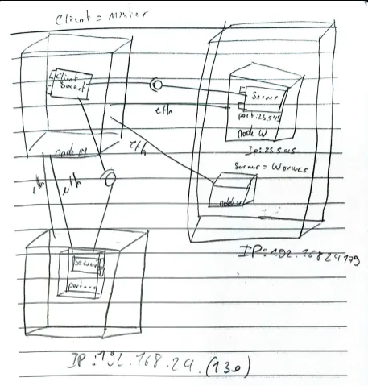
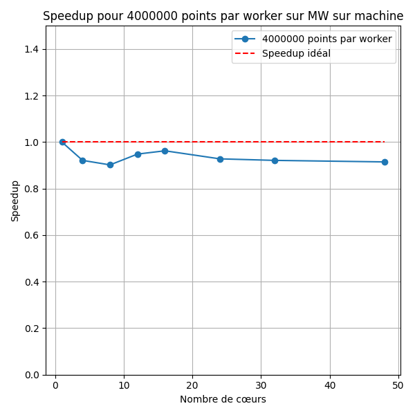
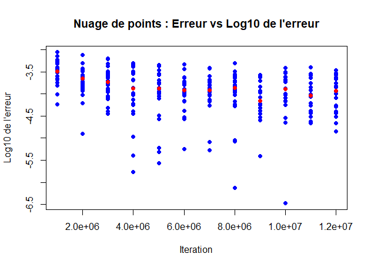

# Rapport

## Sommaire

## I - Méthode de Monte-Carlo

### 1. Présentation de la méthode de Monte-Carlo
### 2. Exemple : Calcul de π
### 3. Génération de points aléatoires
### 4. Estimation de π

## II - Algorithme de parallélisation

### 1. Représentation de l'algorithme
### 2. Analyse de la parallélisation
### 3. Paradigmes de parallélisation

## III - Mise en œuvre

### 1. Analyse de Assignement102
### 2. Analyse de Pi

## IV - Qualité de test de performance

### 1. Cas Assignment102
### 2. Cas Pi
### 3. Automatisation des tests avec Executor
### 4. Justification des changements

## V - Tests de performance

### 1. Scalabilité Forte
### 2. Scalabilité Faible
### 3. Conclusion

## VI - Mise en œuvre Mémoire distribuée

### 1. Analyse du Modèle Socket
#### 1.5. Connexions Ethernet
### 2. Explication des deux `MasterSocket` et `WorkerSocket`
### 3. MasterSocket : Le Client
### 4. WorkerSocket : Le Serveur

## VII - Test de performance Socket

### 1. Analyse de la Scalabilité Forte
### 2. Analyse de la Scalabilité Faible
### 3. Calculs d'efficacité
### 4. Convergence de Pi

## VIII - Norme ISO Efficiency and Effectiveness

### 1. Product Quality (qualité du produit)
### 2. Quality in Use (qualité en utilisation)


## I - Méthode de Monte-Carlo

### Présentation de la méthode de Monte Carlo
La méthode de Monte Carlo est une technique numérique qui résout des problèmes complexes via des simulations aléatoires, en particulier lorsqu'aucune méthode analytique n'est disponible. Elle génère des valeurs aléatoires pour explorer un espace de possibilités et estimer un résultat statistiquement.

### Exemple : Calcul de π
La méthode de Monte Carlo peut être utilisée pour estimer la valeur de $\pi$ en considérant un cercle de rayon 1 inscrit dans un carré de côté 1. En générant des points aléatoires à l'intérieur du carré et en comptant ceux qui tombent à l'intérieur du cercle, on peut estimer $\pi$.

#### Image du modèle :


### Génération de points aléatoires
Les points $P(x_p, y_p)$ sont générés de manière uniforme dans le carré, avec $x_p$ et $y_p$ issus d'une distribution uniforme $U(]0,1[)$. La probabilité qu’un point se trouve dans le cercle est donnée par :

$$
P = \frac{\pi}{4}
$$

En tirant un grand nombre de points $N_\text{tot}$ et en comptant $N_\text{cible}$ ceux dans le cercle, on peut estimer $\pi$ via la formule :

$$
\pi \approx 4 \times \frac{N_\text{cible}}{N_\text{tot}}
$$

### Estimation de π
L’estimation de $\pi$ s’obtient en calculant :

$$
\pi \approx 4 \times \left(\frac{N_\text{cible}}{N_\text{tot}}\right)
$$

## II - Algorithme de parallélisation

### Représentation de l'algorithme
Voici une version simplifiée de l'algorithme utilisé pour l'estimation de $\pi$ via Monte Carlo :

```
initialiser N_cible = 0;
pour p de 0 à N_tot - 1 :
x_p = valeur aléatoire entre 0 et 1;
y_p = valeur aléatoire entre 0 et 1;
si (x_p² + y_p²) < 1 :
N_cible++;
fin pour
```

### Analyse de la parallélisation
L'algorithme peut être parallélisé en identifiant les tâches indépendantes et en synchronisant les sections critiques, comme l'incrémentation de `N_cible`.

#### Tâches principales :
- $T_0$ : Tirage et traitement des $N_\text{tot}$ points.
- $T_1$ : Calcul de l'estimation finale de $\pi$.

#### Dépendances :
- $T_1$ dépend de $T_0$ (il faut traiter tous les points avant de calculer $\pi$).
- $T_{0p2}$ dépend de $T_{0p1}$ (les points doivent être générés avant leur traitement).

#### Ressource critique :
`N_cible` est une ressource critique qui nécessite une synchronisation pour éviter des conflits lors de l'accès concurrent.

### Paradigmes de parallélisation

#### A. Parallélisme de boucle
Chaque itération de la boucle est indépendante, mais la synchronisation est nécessaire pour l’incrémentation de `N_cible`.

```
parallel for p de 0 à N_tot - 1 :
    x_p = rand();
    y_p = rand();
  si (x_p² + y_p²) < 1 :
        N_cible++;
fin for
```

#### B. Approche Master-Worker
Le maître distribue les tâches aux travailleurs, qui retournent le nombre de points dans le cercle. Le maître agrège les résultats pour obtenir `N_cible`.

```
Master_MC:
  for i = 0 : N_worker - 1
    N_cible[i] = Worker_MC[i](N_tot[i])
  for i = 0 : N_worker - 1 
    cpt = cpt + N_cible[i]
```

---

## III - Mise en œuvre

### Analyse de Assignement102
Ce programme utilise une approche d'**itération parallèle**.
L'objectif est de tirer parti des ressources d'un ordinateur avec plusieurs cœurs de processeur pour accélérer le calcul.
Le programme utilise le langage Java et la bibliothèque ExecutorService pour gérer l'exécution parallèle des tâches.

**Structure générale du code :**
Le programme est divisé en deux classes principales :
**Assignment102** : La classe principale qui effectue le calcul de Pi et affiche les résultats.
**PiMonteCarlo** : La classe qui contient la logique d'estimation de Pi en utilisant la méthode de Monte Carlo.

**Description de la classe Assignment102 :**
La classe Assignment102 commence par créer une instance de la classe PiMonteCarlo en lui passant un nombre d'essais (100 000 dans cet exemple) pour réaliser l'estimation de Pi.
Ensuite, le programme mesure le temps d'exécution de la méthode getPi() de l'objet PiMonteCarlo en utilisant System.currentTimeMillis() avant et après l'appel.
Après l'exécution, plusieurs résultats sont affichés :
- La valeur estimée de Pi.
- La différence entre la valeur estimée et la valeur exacte de Pi (Math.PI).
- L'erreur en pourcentage entre la valeur estimée et la valeur exacte.
- Le nombre de processeurs disponibles sur la machine pour l'exécution parallèle.
- La durée d'exécution du calcul.

**Description de la classe PiMonteCarlo :**
La classe PiMonteCarlo contient la logique du calcul de Pi en utilisant la méthode de Monte Carlo,
où des points aléatoires sont générés dans un carré et on compte combien tombent à l'intérieur d'un cercle inscrit dans ce carré.

**Attributs de la classe PiMonteCarlo :**
**nAtomSuccess** : Un compteur atomique (AtomicInteger) qui garde le nombre de points tombant dans le cercle (ces points sont considérés comme des "réussites").
**nThrows** : Le nombre d'essais ou de points générés, passé lors de l'initialisation de l'objet PiMonteCarlo.
**value** : La variable qui contiendra la valeur estimée de Pi après le calcul.

**La classe interne MonteCarlo :**
Il s'agit d'une classe interne implémentant l'interface Runnable.
Chaque instance de cette classe représente une tâche parallèle qui génère un point aléatoire (en utilisant Math.random() pour les coordonnées x et y),
et vérifie si ce point se trouve à l'intérieur du cercle unité.
La condition x * x + y * y <= 1 permet de déterminer si le point est à l'intérieur du cercle inscrit dans le carré de côté 1.

**Méthode getPi() :**
Cette méthode initialise un ExecutorService en utilisant une **piscine de travail** (WorkStealingPool),
qui crée un nombre de threads égal au nombre de processeurs disponibles sur la machine, afin de paralléliser les calculs.
Pour chaque essai (nThrows), une tâche parallèle (MonteCarlo) est soumise à l'exécuteur,
ce qui permet de générer plusieurs points en parallèle. Cela constitue une **itération parallèle**,
où chaque thread travaille indépendamment sur une partie du problème.
Après avoir soumis toutes les tâches, l'exécuteur est fermé avec executor.shutdown(),
et le programme attend que toutes les tâches soient terminées avec while (!executor.isTerminated()).
À la fin des calculs, la valeur estimée de Pi est calculée avec la formule π≈4×(Ncible/Ntot)


**Résultats et affichage :**
Une fois le calcul terminé, le programme affiche :
L'approximation de Pi obtenue.
La différence entre la valeur estimée et la valeur exacte de Pi.
L'erreur relative en pourcentage.
Le nombre de processeurs disponibles pour l'exécution parallèle.
Le temps d'exécution total du calcul, en millisecondes.

### Analyse de Pi
Cette version utilise des **Callables**, des **Futures**, et un **pool de threads** pour répartir les calculs sur plusieurs travailleurs (threads),

**Structure générale du code :**
Le code est composé de trois classes principales :
**`Pi`** : La classe principale qui orchestre le calcul de Pi en appelant la méthode du maître (`Master`).
**`Master`** : La classe qui crée et gère les travailleurs, coordonne l'exécution parallèle et agrège les résultats.
**`Worker`** : La classe qui exécute le calcul pour estimer Pi dans chaque tâche parallèle en simulant des points aléatoires.

**Description de la classe `Pi` :**
La classe `Pi` contient la méthode `main`, où l'exécution du programme commence. Elle crée une instance de la classe `Master` et lui passe les paramètres : le nombre total d'itérations (50000) et le nombre de travailleurs (10).
Ensuite, la méthode `doRun()` du maître est appelée pour effectuer le calcul parallèle, et le résultat (total de réussites) est affiché à l'écran.

**Description de la classe `Master` :**
**`doRun(int totalCount, int numWorkers)`** : Cette méthode gère l'exécution parallèle des travailleurs. Elle crée d'abord une liste de tâches (`Callable<Long>`), où chaque tâche est une instance de la classe `Worker`. Chaque travailleur exécutera un calcul avec un nombre d'itérations défini par `totalCount`.
Un **pool de threads** (`ExecutorService` avec `newFixedThreadPool(numWorkers)`) est créé pour gérer l'exécution parallèle. Les tâches sont soumises à ce pool avec la méthode `invokeAll()`, qui renvoie une liste de `Future<Long>`. Chaque `Future` contient le résultat d'un travailleur.
Le programme attend la fin de toutes les tâches et rassemble les résultats en additionnant les valeurs retournées par chaque travailleur. Ces valeurs représentent le nombre de points dans le cercle unité pour chaque tâche.
Après l'agrégation des résultats, la méthode calcule la valeur de Pi en utilisant la formule :

Enfin, elle affiche la valeur estimée de Pi, l'erreur relative par rapport à la valeur exacte de Pi, le nombre total de points générés, le nombre de processeurs utilisés et le temps d'exécution du calcul.

**Description de la classe `Worker` :**
Chaque **`Worker`** est une tâche parallèle, représentée par un `Callable<Long>`. Cette classe simule la méthode de Monte Carlo pour une estimation de Pi en générant des points aléatoires dans un carré de côté 1.
Pour chaque itération, deux nombres aléatoires (`x` et `y`) sont générés et vérifiés pour voir s'ils se trouvent à l'intérieur d'un cercle inscrit dans ce carré.
Si le point est dans le cercle, un compteur (`circleCount`) est incrémenté. Le résultat de chaque tâche est le nombre total de points dans le cercle pour cette tâche.

**Exécution parallèle avec `Callable` et `Future` :**
Les **Callables** sont utilisés pour encapsuler les tâches à exécuter en parallèle. Contrairement à `Runnable`, un `Callable` peut renvoyer un résultat (ici, un `Long` représentant le nombre de points dans le cercle).
Les **Futures** sont des objets qui représentent le résultat d'une opération qui n'est pas encore terminée. La méthode `get()` de `Future` bloque l'exécution du programme jusqu'à ce que la tâche associée soit terminée, garantissant ainsi que tous les résultats des travailleurs sont collectés avant de procéder à l'agrégation.

**Résultats et affichage :**
Après l'exécution, le programme affiche :
L'approximation de Pi calculée.
L'erreur relative par rapport à la valeur exacte de Pi.
Le nombre total de points générés (calculé comme `totalCount * numWorkers`).
Le nombre de travailleurs utilisés (numéro de processeurs).
Le temps d'exécution du calcul en millisecondes.
Ces résultats permettent d'analyser la précision de l'estimation et l'efficacité de l'exécution parallèle.

Ce programme montre l'utilisation de la méthode de Monte Carlo pour estimer Pi,
avec une approche d'exécution parallèle à l'aide de **Callables**, **Futures**, et d'un **pool de threads**.
Grâce à cette approche, les calculs sont répartis entre plusieurs threads,
ce qui permet de réduire le temps nécessaire pour obtenir une estimation précise de Pi.
Le programme montre aussi l'impact du nombre de travailleurs (threads) sur les performances,
le nombre total d'itérations et la précision de l'estimation.

## IV - Qualité de test de performance

### Cas Assignment102

Pour le programme `Assignment102`, nous avons introduit les changements suivants afin d'améliorer l'efficacité et d'uniformiser les tests :

1. **Acceptation des arguments** :
   Le programme a été modifié pour recevoir les arguments directement depuis un script Python, ce qui permet de varier facilement le nombre d'itérations et de workers. Voici un extrait :
   ```java
   public static void main(String[] args) {
       if (args.length < 2) {
           System.out.println("Usage: java Paradigme.Iteration.Assignment102 <totalCount> <numWorkers>");
           return;
       }
       int totalCount = Integer.parseInt(args[0]);
       int numWorkers = Integer.parseInt(args[1]);
   }
   ```

2. **Affichage des résultats** :
   L'affichage des résultats a été standardisé :
   ```
   System.out.println("Total iterations: " + totalCount);
   System.out.println("Available processors: " + numWorkers);
   System.out.println("Time Duration: " + durationMs + "ms");
   System.out.println("Pi value : " + value);
   System.out.println("Error: " + error + " %");
   ```

3. **Enregistrement dans un fichier** :
   Les résultats sont sauvegardés pour analyse future grâce à la classe `WriteToFile` :
   ```
   String fileName = "personal_pc_12cores_Assignment102_faible";
   WriteToFile.write(totalCount, numWorkers, PiVal.nAtomSuccess.get(), durationMs, value, error, fileName);
   ```

### Cas Pi

Pour le programme `Pi`, des modifications similaires ont été apportées :

1. **Acceptation des arguments** :
   Le programme accepte également les paramètres d'entrée pour simplifier l'exécution depuis un script Python :
   ```java
   public class Pi {
       public static void main(String[] args) throws Exception {
           if (args.length != 2) {
               System.err.println("Usage: java Paradigme.MW.Pi <totalIterations> <numWorkers>");
               System.exit(1);
           }
           int totalIterations = Integer.parseInt(args[0]);
           int numWorkers = Integer.parseInt(args[1]);
       }
   }
   ```

2. **Affichage des résultats** :
   Les résultats sont présentés de manière cohérente avec `Assignment102` :
   ```
   System.out.println("Ntot: " + totalIterations);
   System.out.println("Available processors: " + numWorkers);
   System.out.println("Time Duration (ms): " + (stopTime - startTime));
   System.out.println("Pi value : " + pi);
   System.out.println("Error: " + (Math.abs((pi - Math.PI)) / Math.PI));
   ```

3. **Enregistrement dans un fichier** :
   Les données sont enregistrées pour analyse grâce à :
   ```
   String fileName = "personal_pc_12cores_pi_faible";
   WriteToFile.write(totalIterations, numWorkers, totalInCircle, stopTime - startTime, pi, Math.abs((pi - Math.PI)) / Math.PI, fileName);
   ```

### Automatisation des tests avec Executor

#### ExecutorIteration.py (pour Assignment102)

Ce script Python compile et exécute automatiquement le programme `Assignment102` avec différents paramètres de test :
```python
import os
import subprocess

def compile_java():
    java_files = [
        os.path.join("Paradigme", "Iteration", "Assignment102.java"),
    ]
    for java_file in java_files:
        if os.path.exists(java_file):
            subprocess.run(["javac", java_file], check=True)
        else:
            print(f"Fichier Java non trouvé : {java_file}")
            return

def run_java(total_count, num_workers):
    classpath = "C:/Users/maazn/Desktop/BUT/TP_Parallele/out/production/TP_Parallele"

    java_command = [
        "java", "-cp", classpath, "Paradigme.Iteration.Assignment102",
        str(total_count), str(num_workers)
    ]
    process = subprocess.Popen(java_command, stdout=subprocess.PIPE, stderr=subprocess.PIPE)
    stdout, stderr = process.communicate()

    if process.returncode != 0:
        print(f"Erreur lors de l'exécution du programme Java: {stderr.decode()}")
    else:
        print(stdout.decode())

def main():
    compile_java()

    total_count = 10000520
    worker_list = [1, 2, 3, 4, 5, 6, 7, 8, 9, 10, 11, 12]
    for i in range(5):
        for num_workers in worker_list:
            iterations_per_worker = total_count
            print(f"\nExécution avec {num_workers} workers (scalabilité forte) - {iterations_per_worker} itérations par worker")
            run_java(iterations_per_worker, num_workers)

    total_count = 1000000
    print("\nTest de la scalabilité faible:")
    for num_workers in worker_list:
        total_iterations = total_count * num_workers
        print(f"Scalabilité faible avec {total_iterations} itérations et {num_workers} worker(s)")
        run_java(total_iterations, num_workers)

if __name__ == "__main__":
    main()
```

#### ExecutorMW.py (pour Pi)

Le script suivant est utilisé pour automatiser les tests du programme `Pi` :
```python
import os
import subprocess

def compile_java():
    java_files = [
        os.path.join("Paradigme", "MW", "Pi.java"),
    ]
    for java_file in java_files:
        if os.path.exists(java_file):
            subprocess.run(["javac", java_file], check=True)
        else:
            print(f"Fichier Java non trouvé : {java_file}")
            return

def run_java(total_count, num_workers):
    classpath = "C:/Users/maazn/Desktop/BUT/TP_Parallele/out/production/TP_Parallele"

    java_command = [
        "java", "-cp", classpath, "Paradigme.MW.Pi",
        str(total_count), str(num_workers)
    ]
    process = subprocess.Popen(java_command, stdout=subprocess.PIPE, stderr=subprocess.PIPE)
    stdout, stderr = process.communicate()

    if process.returncode != 0:
        print(f"Erreur lors de l'exécution du programme Java: {stderr.decode()}")
    else:
        print(stdout.decode())

def main():
    compile_java()

    total_count = 1000000
    worker_list = [1, 2, 3, 4, 5, 6, 7, 8, 9, 10, 11, 12]

    print("\nTest de la scalabilité faible:")
    for num_workers in worker_list:
        total_iterations = total_count * num_workers
        print(f"Scalabilité faible avec {total_iterations} itérations et {num_workers} worker(s)")
        run_java(total_iterations, num_workers)

if __name__ == "__main__":
    main()
```

### Justification des changements

- **Uniformisation** : Les affichages et enregistrements sont désormais cohérents entre `Assignment102` et `Pi`, facilitant la comparaison des performances.
- **Automatisation** : Les scripts Python permettent de réaliser les tests rapidement avec divers paramètres sans intervention manuelle.
- **Efficacité** : Passer les arguments directement dans les programmes Java évite la modification du code source pour chaque test.
  Voici ton rapport révisé avec la partie **Scalabilité faible** intégrée, suivie d’une synthèse complète :

## Tests de performance

Les tests ont été réalisés sur un processeur **Ryzen 5 5600H** (6 cœurs logiques, 12 threads hyper-threadés) en utilisant deux scénarios principaux :

1. **Scalabilité forte** : Le nombre total d’itérations est **constant**, fixé à **48 000 000**, pour un nombre de worker de 1,2,3,4,6,8,12.
2. **Scalabilité faible** : Le nombre total d’itérations est **proportionnel** au nombre de workers. Par exemple :
   - 1 worker = 1 000 000 itérations
   - 2 workers = 2 000 000 itérations
   - ...
   - 12 workers = 12 000 000 itérations


### Scalabilité Forte

La répartition des itérations pour un total de **48 000 000** est la suivante :

| Workers | Total Count | Nombre d'itérations par worker |
|---------|-------------|---------------------------------|
| 1       | 48 000 000  | 48 000 000                     |
| 2       | 48 000 000  | 24 000 000                     |
| 3       | 48 000 000  | 16 000 000                     |
| 4       | 48 000 000  | 12 000 000                     |
| 6       | 48 000 000  | 8 000 000                      |
| 8       | 48 000 000  | 6 000 000                      |
| 12      | 48 000 000  | 4 000 000                      |

Analyse de la répartition des ressources :
La charge de travail, répartie entre les workers, varie en fonction du nombre de workers.
Pour un seul worker, celui-ci traite l'intégralité des 48 000 000 itérations, tandis que pour 12 workers, chaque worker est responsable de 4 000 000 itérations.
La répartition idéale serait d'avoir une charge de travail équitablement répartie entre les workers.

#### Analyse des résultats pour Pi

| Workers | Speedup Observé | Efficacité (%) | Speedup Idéal |
|---------|-----------------|----------------|--------------|
| 1       | 1.00            | 100.00         | 1            |
| 2       | 0.73            | 73.00          | 2            |
| 3       | 0.67            | 66.67          | 3            |
| 4       | 0.65            | 65.00          | 4            |
| 6       | 0.56            | 56.00          | 6            |
| 8       | 0.51            | 51.00          | 8            |
| 12      | 0.43            | 43.00          | 12           |


Analyse des résultats :
Le speedup observé pour Pi est sublinéaire, c’est-à-dire que l'amélioration des performances ralentit à mesure que le nombre de workers augmente.
Bien que le speedup augmente avec chaque ajout de worker, les gains deviennent de plus en plus petits au fur et à mesure que l'on approche du nombre de cœurs physiques disponibles.
Cela peut être expliqué par la loi de Amdahl, qui stipule qu'à un certain point, l'augmentation du nombre de workers ne mène plus à des gains proportionnels en raison de la gestion des ressources limitées (comme le nombre de cœurs physiques).
L’efficacité diminue également à mesure que le nombre de workers augmente.
Elle est maximale pour un seul worker, mais chute progressivement à environ 43 % pour 12 workers, ce qui montre que l’ajout de workers supplémentaires engendre des coûts d’overhead et des pertes d’efficacité.


#### Analyse des résultats pour Assignment102

| numWorkers | speedup_observed | efficiency (%) | speedup_optimal |
|------------|------------------|----------------|-----------------|
| 1          | 1.1946809        | 119.468091     | 1               |
| 2          | 0.8535724        | 42.678619      | 2               |
| 3          | 0.8088633        | 26.962110      | 3               |
| 4          | 0.7842123        | 19.605307      | 4               |
| 6          | 0.6754880        | 11.258133      | 6               |
| 8          | 0.7582078        | 9.477597       | 8               |
| 12         | 0.7091835        | 5.909863       | 12              |


Analyse des résultats :
Le speedup observé pour Assignment102 est très faible et même négatif dans une certaine mesure, ce qui signifie qu’ajouter plus de workers ne conduit pas à une amélioration des performances.
Au contraire, cela entraîne souvent une dégradation des performances.
Cela est dû au fait que le sémaphore, utilisé pour gérer les accès concurrents aux ressources partagées, génère des blocages importants, ce qui empêche les workers d'exécuter leurs tâches de manière parallèle efficace.
L’efficacité pour Assignment102 chute rapidement à mesure que le nombre de workers augmente, montrant que la gestion des threads et des blocages dus au sémaphore est trop élevé pour tirer parti des cœurs supplémentaires.
À 12 workers, l'efficacité atteint seulement 5,91 %, ce qui indique que l'addition de workers entraîne une sous-utilisation des ressources processeur.


### Scalabilité Faible

#### Analyse des résultats pour Pi 

| Workers | Speedup Observé | Efficacité (%) | Speedup Idéal |
|---------|-----------------|----------------|--------------|
| 1       | 1.00            | 100.00         | 1            |
| 2       | 0.88            | 43.75          | 2            |
| 3       | 0.79            | 26.42          | 3            |
| 4       | 0.78            | 19.44          | 4            |
| 5       | 0.71            | 14.24          | 5            |
| 6       | 0.76            | 12.73          | 6            |
| 7       | 0.74            | 10.53          | 7            |
| 8       | 0.70            | 8.75           | 8            |
| 9       | 0.68            | 7.53           | 9            |
| 10      | 0.62            | 6.18           | 10           |
| 11      | 0.51            | 4.60           | 11           |
| 12      | 0.52            | 4.32           | 12           |


Analyse des résultats pour Pi :
Les résultats pour Pi montrent une scalabilité faible raisonnable.
Le speedup observé diminue légèrement à mesure que le nombre de workers augmente, ce qui est typique d'une scalabilité faible.
Le gain en performance reste présent jusqu'à 12 workers. Par exemple, à 1 worker, le speedup est de 1, mais il reste autour de 0.52 à 12 workers, ce qui montre que l'ajout de workers apporte une amélioration, bien que cette amélioration soit de plus en plus faible.

Cependant, l'efficacité n'est pas optimale. Bien que le speedup reste relativement constant, l'efficacité chute significativement.
À 2 workers, l'efficacité tombe à 43.75%, et elle diminue encore plus pour atteindre 4.32% à 12 workers.
Cette baisse de l'efficacité signifie que l'ajout de workers, bien qu'améliorant encore légèrement les performances, entraîne une surcharge dans la gestion des ressources partagées.
Cela traduit des coûts supplémentaires en termes de synchronisation et de communication entre les workers, ce qui empêche d'atteindre une efficacité optimale.

#### **Analyse des résultats pour Assignment102 - Calcul avec Itérations et Sémaphore**

| Worker | Speedup Observé | Efficacité (%) | Speedup Idéal |
|--------|-----------------|----------------|---------------|
| 1      | 1.00           | 100.00         | 1             |
| 2      | 0.47           | 23.46          | 1             |
| 3      | 0.28           | 9.22           | 1             |
| 4      | 0.29           | 7.14           | 1             |
| 5      | 0.14           | 2.80           | 1             |
| 6      | 0.13           | 2.24           | 1             |
| 7      | 0.11           | 1.55           | 1             |
| 8      | 0.08           | 0.98           | 1             |
| 9      | 0.09           | 0.97           | 1             |
| 10     | 0.08           | 0.81           | 1             |
| 11     | 0.05           | 0.48           | 1             |
| 12     | 0.06           | 0.47           | 1             |


Analyse des résultats pour Assignment102 :
Les résultats pour Assignment102 montrent clairement une scalabilité faible et inefficace.
Le speedup observée chute rapidement et devient très faible à partir de 2 workers, atteignant seulement 0.06 à 12 workers, ce qui indique une très mauvaise performance avec l'ajout de workers.
L'efficacité diminue également de manière drastique, passant de 100% à 47% dès 2 workers, et tombant à 0.47% à 12 workers.
Cette dégradation rapide de l'efficacité démontre que Assignment102 ne bénéficie pas du parallélisme et souffre d'un blocage à cause des sémaphores.


### Conclusion

Pour le calcul de Pi, on remarque une scalabilité forte sous-linéaire, avec un speedup limité par les coûts de gestion.
Bien que le parallélisme permette d'améliorer les performances, les gains restent relativement faibles en raison des coûts de synchronisation et de la répartition des tâches.
En revanche, dans le cas de la scalabilité faible, l'efficacité chute de manière significative avec l'augmentation du nombre de workers, ce qui montre une perte d'efficacité à mesure que l'on augmente la parallélisation.

En ce qui concerne Assignment102, tant la scalabilité forte que faibles montrent une scalabilité négative, principalement à cause des blocages engendrés par l'utilisation des sémaphores.
Elles annulent tous les avantages du parallélisme, entraînant une dégradation des performances.
Pour améliorer les performances des applications, deux solutions peuvent être envisagées. Tout d'abord, pour Monte Carlo, il serait judicieux de ne prendre en compte que les 25 % des données qui ne sont pas dans la cible, ce qui réduirait la quantité de données à traiter et améliorerait ainsi les performances.
Ensuite, il serait pertinent de distribuer le calcul sur plusieurs PC, en utilisant uniquement des cœurs physiques et en évitant les cœurs hyper-threadés, afin de mieux exploiter les ressources matérielles disponibles.

## V - Mise en œuvre Mémoire distibué

### Analyse du Modèle Socket

#### Architecture Client-Serveur 
Le schéma étudié illustre une architecture **Client-Serveur** basé sur l’utilisation de **Sockets** pour l’échange de données au sein d’un réseau.
Cette structure constitue un modèle d’applications distribuées, où plusieurs clients et serveurs interagissent pour accomplir des tâches parallèle.


#### Composants Clés

#### Partie Client
Dans un environnement distribué, le **client** représente un node capable de communiquer avec un ou plusieurs serveurs via un **Socket**.
Il permet d'établir une connexion réseau entre les différents node servers.

Les étapes d’utilisation du socket dans le développement distribué sont les suivantes :
- **Création du socket** : Le client initialise un socket en précisant l’adresse **IP** et le **port** du serveur.
- **Connexion** : Le client établit une connexion réseau avec le serveur.
- **Envois de requêtes** : Le client transmet des données aux serveurs pour traiter les données.
- **Réception des réponses** : Les résultats des traitements distribués, une fois calculés par le serveur, sont renvoyés au client.

#### Partie Serveur
Dans un système distribué, le **serveur** traite assure la connexion du client.
L’utilisation de **ServerSocket** permet au serveur d’écouter les requêtes entrantes sur un **port spécifique**.

Les composants essentiels du serveur :
- **Node Master** : Le **nœud principal** responsable de coordonner les requêtes, de répartir les traitements entre différents **workers**, et de calculer les résultats finaux.
- **Server Worker** : Des **threads** ou des instances indépendantes chargées de traiter les requêtes clients en parallèle.

**Étapes du serveur pour le développement distribué** :
1. **Initialisation** : Le serveur configure un **socket d’écoute** pour recevoir les connexions du client.
2. **Acceptation des connexions** : Lorsqu’un client se connecte, une nouvelle instance de **socket** est créée.
3. **Répartition des traitements** : Les requêtes reçues sont traitées par des **workers**.
4. **Retour des résultats** : Les résultats sont envoyés au client.

#### Connexions Ethernet
La communication entre les clients et les serveurs repose sur une liaison **Ethernet**.
Chaque machine du réseau est identifiée par une **adresse IP**.

Dans le schéma :
- Le **serveur 1** utilise l’adresse **IP : 192.168.24.193** comme point d’écoute.
- L’adresse **192.168.24.130** correspond à un autre serveur ou à un nœud secondaire.

### Explication des deux `MasterSocket` et ` WorkerSocket` 

Les classes **`MasterSocket`** et **`WorkerSocket`** illustrent le modèle distribué en utilisant l'architecture vue dans la dernière partie.
Le **MasterSocket** agit comme un client qui répartit des tâches à plusieurs serveurs (**WorkerSocket**), lesquels renvoient les résultats après avoir effectué un calcul local.

### MasterSocket : Le Client
La classe **`MasterSocket`** représente le client. Son rôle est de :
1. **Établir une connexion avec plusieurs Workers**.
2. **Envoyer une tâche** à chaque Worker.
3. **Récolter les résultats** des Workers pour effectuer un calcul final.

#### Création des connexions avec les Workers
Le **MasterSocket** utilise des **sockets** pour établir des connexions avec les Workers. Les ports sont définis dans un tableau `tab_port` pour permettre plusieurs connexions simultanées.

```
sockets[i] = new Socket(ip, tab_port[i]); // Connexion à chaque worker via son port
System.out.println("SOCKET = " + sockets[i]);

reader[i] = new BufferedReader(new InputStreamReader(sockets[i].getInputStream())); 
writer[i] = new PrintWriter(new BufferedWriter(new OutputStreamWriter(sockets[i].getOutputStream())), true);
```
- **`new Socket(ip, port)`** : Crée un socket client pour se connecter au Worker.
- **`BufferedReader`** et **`PrintWriter`** : Permettent respectivement la lecture et l’écriture des messages entre le Master et les Workers.

#### Envoi des tâches aux Workers
Le Master demande à chaque Worker de réaliser un **calcul de Monte Carlo**. Le nombre de lancés est transmis via le socket.

```
String message_to_send = String.valueOf(totalCount); // Nombre de points à traiter
for (int i = 0; i < numWorkers; i++) {
    writer[i].println(message_to_send); // Envoi du nombre de points aux Workers
}
```
- **`writer[i].println(message)`** : Envoie la tâche sous forme de message à chaque Worker.

#### Réception des résultats des Workers
Après l’exécution du calcul, chaque Worker renvoie le nombre de points tombant dans le quart de disque.

```
for (int i = 0; i < numWorkers; i++) {
    tab_total_workers[i] = reader[i].readLine(); // Lecture des résultats depuis les Workers
    total += Long.parseLong(tab_total_workers[i]); // Somme des résultats
}
```
- **`reader[i].readLine()`** : Reçoit le message renvoyé par le Worker.
- Les résultats sont additionnés pour estimer la valeur de **π**.

### WorkerSocket : Le Serveur
La classe **`WorkerSocket`** agit comme un **serveur**. Chaque Worker écoute un **port spécifique**, reçoit les instructions du Master, effectue un **calcul local**  et renvoie le résultat.

#### Acceptation de la connexion
Le **WorkerSocket** écoute sur un port donné et accepte une connexion entrante depuis le Master.

```java
ServerSocket server = new ServerSocket(port);
Socket soc = server.accept(); // Acceptation de la connexion avec le Master
```
- **`ServerSocket`** permet au Worker d’écouter les requêtes entrantes.
- **`accept()`** bloque le programme jusqu’à ce qu’une connexion soit établie.

#### Réception de la tâche et exécution
Le Worker reçoit le nombre de points à lancer pour la méthode de Monte Carlo, effectue le calcul et renvoie le résultat.

```
str = bRead.readLine(); // Lecture du message depuis le Master
long total = monteCarlo(Integer.parseInt(str)); // Calcul Monte Carlo
pWrite.println(total); // Envoi du résultat au Master
```
Traite le nombre d'itérations reçu, exécute Monte Carlo et renvoie le résultat obtenu au Master

## VI-Teste de performance Socket
Les tests ont été effectués sur 12 machines identiques, équipées chacune de 8 cœurs hyper-threadés.
Chaque machine possède 4 cœurs physiques, nous avons limité l’exécution à 4 processus par machine.
Cela donne un total de 48 processus pour l’ensemble du cluster.
Les temps affichés dans les tableaux suivants sont des moyennes calculées sur plusieurs essais.

### Analyse de la Scalabilité Forte

Les résultats des tests pour la scalabilité forte sont présentés ci-dessous :

| Machines | Points totaux | Points / Worker | Nombre de Processeurs | Temps (ms) | Speedup Observé | Efficacité (%) |
|----------|---------------|------------------|-----------------------|------------|-----------------|----------------|
| 1        | 192 000 000   | 192 000 000      | 1                     | 5873       | 1.000000        | 100.00000      |
| 1        | 192 000 000   | 48 000 000       | 4                     | 1506       | 3.899734        | 97.49336       |
| 2        | 192 000 000   | 24 000 000       | 8                     | 756        | 7.768519        | 97.10648       |
| 3        | 192 000 000   | 16 000 000       | 12                    | 508        | 11.561024       | 96.34186       |
| 4        | 192 000 000   | 12 000 000       | 16                    | 385        | 15.254545       | 95.34091       |
| 6        | 192 000 000   | 8 000 000        | 24                    | 267        | 21.996255       | 91.65106       |
| 8        | 192 000 000   | 6 000 000        | 32                    | 206        | 28.509709       | 89.09284       |
| 12       | 192 000 000   | 4 000 000        | 48                    | 133        | 44.157895       | 91.99561       |


Les résultats montrent que l’algorithme distribué améliore considérablement la scalabilité forte de l’algorithme Pi.
Le **speedup** obtenu avec l’approche distribuée est plus proche du speedup idéal que celui de la version en mémoire partagée.

### Analyse de la Scalabilité Faible

Les résultats pour la scalabilité faible sont les suivants :

| Machines | Points totaux | Points / Worker | Nombre de Processeurs | Temps (ms) | Speedup  | Efficacité (%) |
|----------|---------------|------------------|-----------------------|------------|----------|----------------|
| 1        | 4 000 000     | 4 000 000        | 1                     | 129        | 1.0000000 | 100.00000      |
| 1        | 16 000 000    | 4 000 000        | 4                     | 140        | 1.0000000 | 100.00000      |
| 2        | 32 000 000    | 4 000 000        | 8                     | 143        | 0.9020979 | 90.20979       |
| 3        | 48 000 000    | 4 000 000        | 12                    | 136        | 1.0294118 | 102.94118      |
| 4        | 64 000 000    | 4 000 000        | 16                    | 134        | 0.9626866 | 96.26866       |
| 6        | 96 000 000    | 4 000 000        | 24                    | 139        | 1.0071942 | 100.71942      |
| 8        | 128 000 000   | 4 000 000        | 32                    | 140        | 0.9214286 | 92.14286       |
| 12       | 192 000 000   | 4 000 000        | 48                    | 141        | 0.9929078 | 99.29078       |



L’algorithme distribué améliore aussi la scalabilité faible de l’algorithme Pi. 
Le speedup est plus proche du speedup idéal comparé à la version en mémoire partagée.

### Calculs d'efficacité

#### Scalabilité forte
Le **speedup observé** est défini par :  
\[
Speedup_{observé} = \frac{T_1}{T_p}
\]  
où \(T_1\) est le temps d'exécution avec un seul processeur, et \(T_p\) le temps avec \(p\) processeurs.

L’**efficacité** est alors calculée par :  
\[
Efficacité = \frac{Speedup_{observé}}{p}
\]  
Cela mesure la proportion d’accélération réellement obtenue par rapport au nombre de processeurs ajoutés.

#### Scalabilité faible
Pour la scalabilité faible, l’**efficacité** est définie comme :  
\[
Efficacité = \left(\frac{T_{ref}}{T_{p}}\right) \times 100
\]  
où \(T_{ref}\) est le temps de référence pour une machine, et \(T_p\) le temps mesuré avec \(p\) machines.

Le calcul du speedup et de l’efficacité est essentiel pour évaluer les performances des algorithmes parallèles. Ces résultats montrent que l’approche distribuée est plus robuste que les versions en mémoire partagée, permettant d’exploiter pleinement les ressources tout en évitant les problèmes d’accès.

### Convergence de Pi

L'erreur de Pi est directement influencée par la taille du problème.



Sur le graphique, les points bleus montrent l'erreur pour chaque itération, calculée en échelle logarithmique. Les points rouges représentent la médiane des erreurs des points bleus.
On voit que notre algorithme se rapproche peu à peu de la vraie valeur de Pi. Plus on utilise de points pour le calcul, plus l'erreur diminue.
Comme pour l'efficacité dans le calcul parallèle, cette amélioration dépend directement des efforts fournis. En augmentant le nombre de points ou d'itérations, on obtient une meilleure approximation de Pi, tout comme ajouter des processeurs améliore les performances d'un système.
Cependant, on remarque encore quelques erreurs très élevées (points bleus en bas du graphique). 
Cela montre que, même si la tendance générale est bonne, des variations peuvent exister. Ces erreurs sont dues à des limites dans les données ou des approximations.

## VII - Norme ISO Efficiency and Effectiveness

La norme ISO/IEC 25000 SQuaRE (Software Quality Requirements and Evaluation) propose un cadre structuré pour définir, évaluer et améliorer la qualité des logiciels.
Elle répond à un besoin de standardisation permettant d’assurer une compréhension commune entre développeurs, gestionnaires de projets et utilisateurs finaux.
Cette norme vise à uniformiser les critères d’évaluation de la qualité des logiciels, facilitant ainsi la communication entre toutes les parties prenantes.
De cette manière, il devient possible d’identifier et de corriger les points faibles des logiciels, favorisant une amélioration continue.
L’adoption de telles normes renforce la confiance des utilisateurs et clients en garantissant la fiabilité des produits tout en réduisant les coûts liés à la maintenance et aux risques d’échecs en production.

### Efficiency and Effectiveness

Dans le cadre de la norme ISO/IEC 25000, les notions d'**efficiency** (efficience) et d'**effectiveness** (effectivité) sont essentielles pour évaluer la qualité d'un logiciel. 
Ces termes puissent sembler similaires, leur application varie en fonction du point de vue adopté : celui du produit (Quality in Product) ou celui de l'utilisateur (Quality in Use).

#### Product Quality (Qualité du produit)

- **Cible** : Les développeurs et équipes techniques.
- **Objectif** : Fournir une analyse approfondie des caractéristiques internes du logiciel, telles que le code, l’architecture ou la performance.
- **Exemple** : Un logiciel bien structuré, respectant les principes de performance, de maintenabilité et d'extensibilité, sera plus facile à déployer, maintenir et faire évoluer.
- **Efficiency** : Dans le contexte de la qualité du produit, l'efficience fait référence à la **performance du logiciel par rapport à la quantité de ressources** (temps, mémoire, processeur, etc.) utilisées pour accomplir une tâche dans des conditions spécifiées. Il s'agit donc d'évaluer la capacité du produit à accomplir ses tâches de manière **optimisée** en termes de consommation de ressources.
- **Effectiveness** : L'effectivité, dans le cadre de la qualité du produit, désigne la capacité du logiciel à **atteindre les objectifs fonctionnels** pour lesquels il a été conçu, en produisant des résultats **corrects et précis**. Par exemple, un logiciel de calcul doit produire des résultats exacts pour être considéré comme "effective", indépendamment de l'efficacité des ressources utilisées.

**Performance efficiency** : Il s'agit de l'efficacité du produit mesurée par la **performance** relative à la **quantité de ressources** utilisées dans des conditions spécifiées. Cela peut inclure l'évaluation du temps d'exécution ou de la mémoire utilisée pendant les opérations du logiciel.

#### Quality in Use (Qualité en utilisation)

- **Cible** : Les utilisateurs finaux ou les clients.
- **Objectif** : Évaluer si le logiciel permet aux utilisateurs d'atteindre les objectifs pour lesquels il a été conçu dans des scénarios d’utilisation réels.
- **Exemple** : Une application mobile qui permet aux utilisateurs de réserver un billet d’avion rapidement, sans frustration ni erreur, sera perçue comme efficace (effectiveness) et efficiente (efficiency) par l’utilisateur.
- **Efficiency** : Dans le cadre de la qualité en utilisation, l'efficience fait référence à la **quantité de ressources** (temps, effort, nombre d’interactions, etc.) nécessaires pour accomplir une tâche. Plus un utilisateur peut atteindre son objectif avec moins de ressources (en termes de temps ou d'effort), plus le système est considéré comme efficient.
- **Effectiveness** : L'effectivité, dans *Quality in Use*, évalue la capacité de l'utilisateur à atteindre ses objectifs ou à accomplir ses tâches avec **précision** et **complétude**. Il s'agit de savoir si l'utilisateur parvient à réaliser ses buts sans erreurs ou difficultés. Par exemple, une application de réservation d'avion est **effective** si elle permet à l'utilisateur de compléter sa réservation avec succès.

### Comparaison entre Product Quality et Quality in Use

Les deux concepts évaluent des aspects similaires d'efficacité et d'efficience, mais à des niveaux d’abstraction différents :
- **Product Quality** : L'**efficiency** et l'**effectiveness** se concentrent sur l'aspect **technique** et **fonctionnel** du logiciel, c'est-à-dire, sur ses capacités intrinsèques à accomplir les tâches en optimisant l'utilisation des ressources (temps, mémoire, etc.), et à fournir des résultats corrects.
- **Quality in Use** : L'**efficiency** et l'**effectiveness** concernent l'impact réel du logiciel sur l'expérience de l'utilisateur final. Ici, l'efficacité mesure l'optimisation des ressources de l'utilisateur pour accomplir ses objectifs, et l'effectivité mesure si l'utilisateur peut atteindre ces objectifs avec succès et sans erreurs.

Ainsi, bien que les concepts de **efficiency** et **effectiveness** mesurent des qualités similaires dans les deux contextes, ils se distinguent par leur **perspective** :
- **Product Quality** évalue la **performance interne du produit** en termes d'utilisation des ressources techniques.
- **Quality in Use** évalue l'**impact réel sur l'utilisateur**, en mesurant comment il interagit avec le produit et la facilité avec laquelle il atteint ses objectifs.

**Product Quality** et **Quality in Use** mesurent donc des qualités semblables, mais adaptées aux différents **besoins** et **perspectives** des développeurs (aspects internes) et des utilisateurs finaux (aspects pratiques).


J'ai utilisé ChatGPT pour corriger mes fautes et l'écriture du sommaire, ainsi que pour me générer le code LaTeX pour l'écriture mathématique.